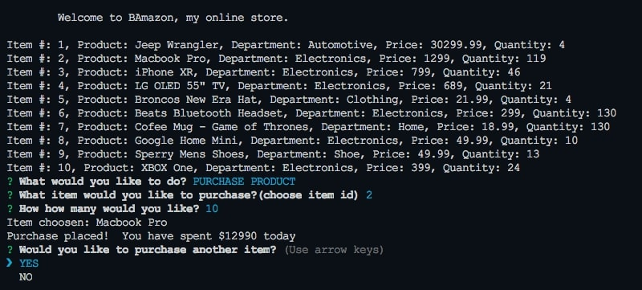

## Bamazon Store App - Node version of Amazon

### Breakdown
---

This app clones the basic idea of an online store such as Ebay or Amazon (hence name Bamazon). At a basic level this shows the ability of a database.

### Languages Used
---
This app uses Node.js and mySQL as the database.

### SQL Database
---

# Intro: Bamazon Consumer 📫️
---
When you sart the app it will display two choices for the user to select.

## Product List 🛒
___
When user selects the "purchase product" choice it will display all the current products in the store and it's respective details.

## In Stock 😁
---
When the item is in-stock and the user decides to purchase it.  A thank you message is displayed and the stock is depleted. 

## Out of Stock 🙁
---
When the user decides to purchase and item and it is out of stock.  A message is displayed "Insufficient amount" and user is asked to select another product.

## End Shopping 🛍️
---
Another option the user has is to end the shopping experience after they have chosen to purchase an item.

----
---

# Intro: Bamazon Manager

When you start the app it will display your choices as a manager

## View Products
---
When you select the Products for Sale you are able to see what is currently in the database

## View Low Inventory
---
This option allows the manager to see what if currently low on supply, anything 10 items or less are considered low.

## Add to Inventory
---
This option allows the manager to add more stock to a specific item id.

## Add New Product
---
This option allows the manager to add a new product to the current database.  Asks for product name, what department to store it in, the price and how many to stock.  Once complete there is a console of how much of the product has been stocked. 

